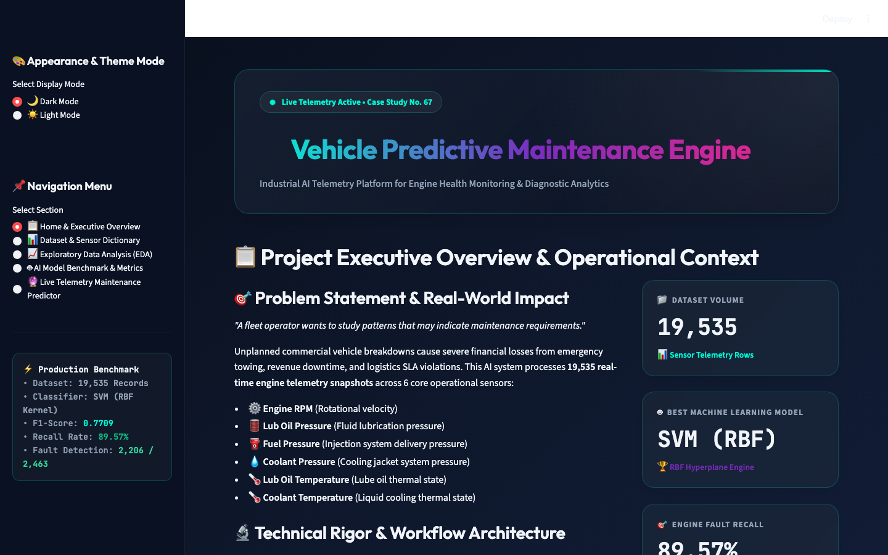
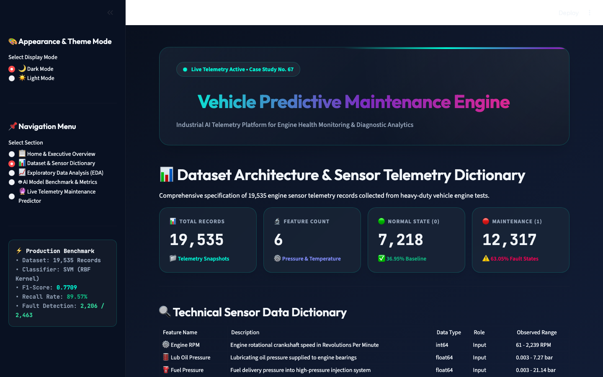
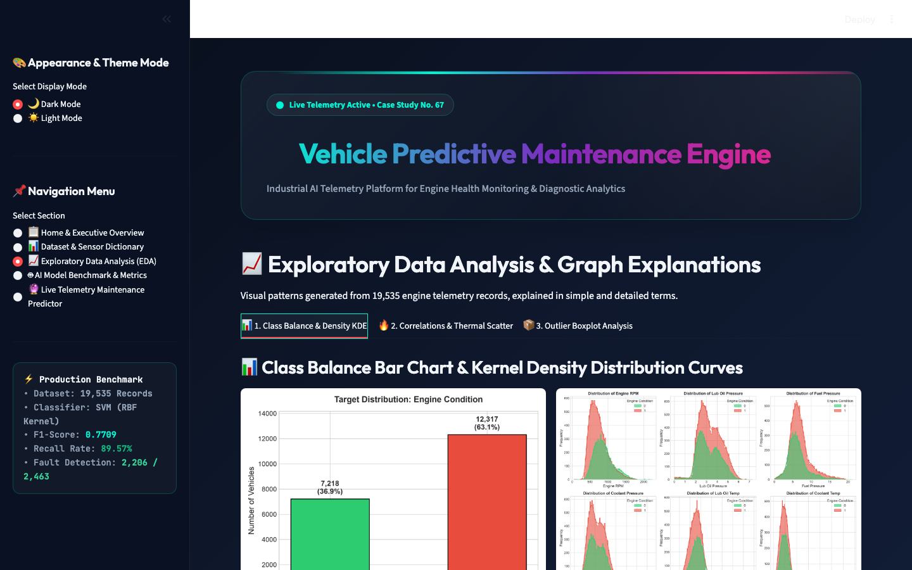
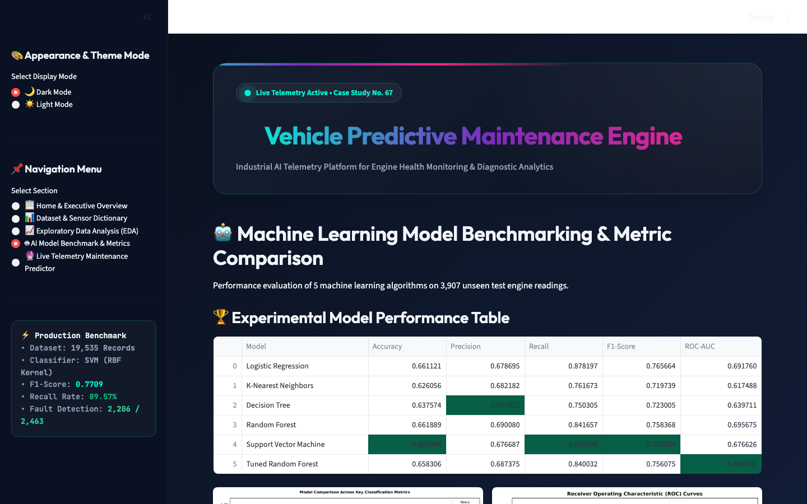
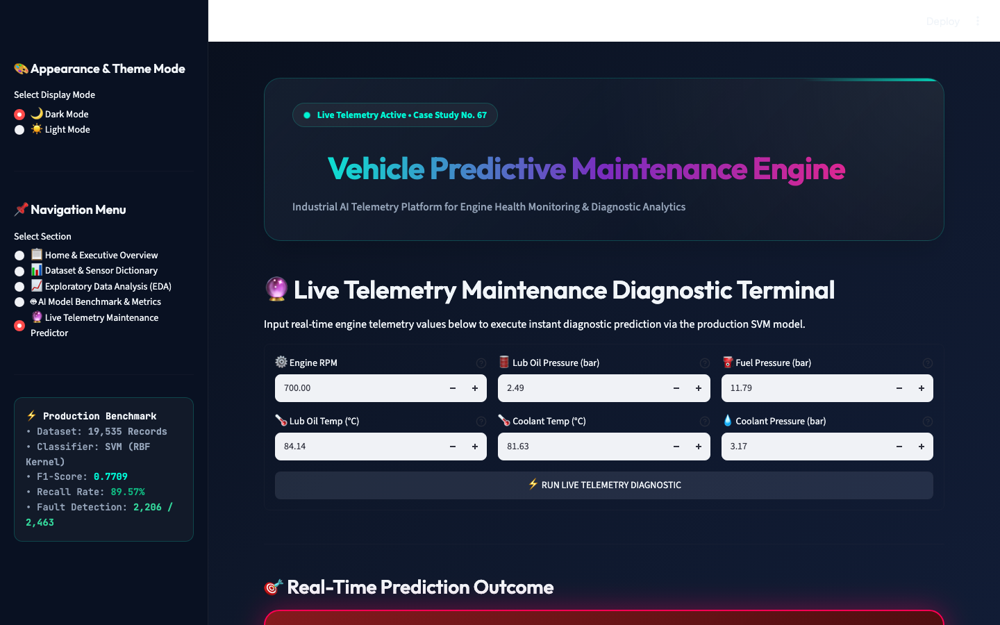

# Vehicle Maintenance Analysis and Prediction Using Machine Learning

> **Academic ML Project — Case Study No. 67**  
---

## 1. Project Overview
Predictive maintenance utilizes real-time sensor telemetry to anticipate mechanical faults before component failure occurs. This project implements an end-to-end Machine Learning solution that analyzes vehicle engine sensor parameters (RPM, oil pressure, fuel pressure, coolant pressure, and temperatures) to determine whether an engine operates normally or requires maintenance.

---

## 🖼️ Streamlit Web Application Screenshots

The project includes an interactive Streamlit web application featuring dual theme support (Dark/Light modes), custom typography, glassmorphism cards, micro-animations, and real-time engine telemetry prediction.

### 📋 1. Executive Overview & Key Telemetry Metrics


### 📊 2. Dataset Architecture & Sensor Data Dictionary


### 📈 3. Exploratory Data Analysis & Detailed Graph Explanations


### 🤖 4. AI Model Benchmark & Performance Evaluation


### 🔮 5. Live Telemetry Maintenance Predictor Terminal


---

## 2. Problem Statement
*"A fleet operator wants to study patterns that may indicate maintenance requirements."*

Catastrophic engine failure leads to costly operational downtime and safety hazards. By analyzing sensor telemetry, fleet managers can shift from reactive maintenance to automated predictive maintenance powered by machine learning.

---

## 3. Objectives
- Analyze 19,535 engine telemetry records.
- Perform exploratory data analysis and data preprocessing without data leakage.
- Train and compare 5 classification models: **Logistic Regression**, **K-Nearest Neighbors (KNN)**, **Decision Tree**, **Random Forest**, and **Support Vector Machine (SVM)**.
- Perform Stratified 5-Fold Cross-Validation and Hyperparameter Tuning.
- Evaluate models using Accuracy, Precision, Recall, F1-Score, and ROC-AUC.
- Deploy the optimal model as an interactive Streamlit dashboard.

---

## 4. Dataset
- **Name**: Automotive Vehicles Engine Health Dataset
- **Total Records**: 19,535 rows
- **Total Columns**: 7 (6 Input Features + 1 Target Variable)
- **Target Classes**:
  - `0`: Normal Condition (7,218 records / 36.95%)
  - `1`: Maintenance Required (12,317 records / 63.05%)

---

## 5. Features Data Dictionary

| Feature Name | Description | Type | Role | Units / Range |
| :--- | :--- | :--- | :--- | :--- |
| **Engine RPM** | Engine rotational speed | Numerical (`int64`) | Input Feature | 61 – 2,239 RPM |
| **Lub Oil Pressure** | Lubricating oil pressure | Numerical (`float64`) | Input Feature | 0.003 – 7.27 bar |
| **Fuel Pressure** | Fuel delivery pressure | Numerical (`float64`) | Input Feature | 0.003 – 21.14 bar |
| **Coolant Pressure** | Cooling system pressure | Numerical (`float64`) | Input Feature | 0.002 – 7.48 bar |
| **Lub Oil Temp** | Lubricating oil temperature | Numerical (`float64`) | Input Feature | 71.32 – 89.58 °C |
| **Coolant Temp** | Engine coolant temperature | Numerical (`float64`) | Input Feature | 61.67 – 195.53 °C |
| **Engine Condition** | Maintenance status | Categorical (`int64`) | Target Label | `{0: Normal, 1: Maintenance}` |

---

## 6. Machine Learning Approach
1. **Data Preprocessing**: Standard scaling fitted exclusively on the 80% training set to prevent data leakage.
2. **Train-Test Split**: Reproducible 80/20 stratified split (`random_state=42`).
3. **Model Fitting**: Baseline fitting followed by 5-Fold Stratified Cross-Validation.
4. **Optimization**: GridSearchCV hyperparameter optimization.
5. **Model Serialization**: Exporting optimal model pipeline using `joblib`.

---

## 7. Algorithms Used
1. **Logistic Regression**: Linear baseline probabilistic model.
2. **K-Nearest Neighbors (KNN)**: Non-parametric distance-based classifier ($k=5$).
3. **Decision Tree**: Non-linear tree classifier (`max_depth=10`).
4. **Random Forest**: Ensemble bagging classifier (`n_estimators=100`).
5. **Support Vector Machine (SVM)**: Kernel-based margin classifier ($RBF$ kernel).

---

## 8. Evaluation Metrics
- **Accuracy**: Overall proportion of correct predictions.
- **Precision**: Proportion of correctly identified maintenance flags among all flagged vehicles.
- **Recall**: Proportion of actual maintenance cases successfully identified by the model.
- **F1-Score**: Harmonic mean of Precision and Recall.
- **ROC-AUC**: Receiver Operating Characteristic Area Under Curve.

---

## 9. Project Structure
```
ml_finalproject/
├── data/
│   └── dataset.csv                      # Primary dataset (19,535 rows)
├── notebooks/
│   └── vehicle_maintenance_analysis.ipynb # 22-Section Jupyter Notebook
├── src/
│   ├── data_preprocessing.py            # Data loading, cleaning, & train-test scaling
│   ├── eda.py                           # EDA plot generation
│   ├── train_models.py                  # Model training, CV, tuning, & evaluation
│   └── predict.py                       # Prediction module with safety validation
├── models/
│   ├── final_model.joblib               # Saved Support Vector Machine model
│   ├── scaler.joblib                    # Fitted StandardScaler
│   └── feature_names.joblib             # Saved feature order
├── app/
│   └── streamlit_app.py                 # Streamlit web dashboard
├── outputs/
│   ├── figures/                         # Saved high-res EDA and evaluation charts
│   └── metrics/                         # CSV and JSON model evaluation metrics
├── requirements.txt                     # Package dependencies
└── README.md                            # Project documentation
```

---

## 10. Installation
```bash
# 1. Clone or navigate to project directory
cd ml_finalproject

# 2. Create Python virtual environment
python3 -m venv venv
source venv/bin/activate

# 3. Install requirements
pip install -r requirements.txt
```

---

## 11. Running the Notebook
```bash
# Launch Jupyter Notebook
jupyter notebook notebooks/vehicle_maintenance_analysis.ipynb
```

---

## 12. Running the Streamlit Application
```bash
# Launch Streamlit dashboard
streamlit run app/streamlit_app.py
```
Open browser at `http://localhost:8501`.

---

## 13. Example Prediction
Using sample inputs:
- Engine RPM: `700.0`
- Lub Oil Pressure: `2.49 bar`
- Fuel Pressure: `11.79 bar`
- Coolant Pressure: `3.17 bar`
- Lub Oil Temp: `84.14 °C`
- Coolant Temp: `81.63 °C`

Output:
- **Prediction**: `Maintenance Required`
- **Maintenance Probability**: `65.22%`
- **Normal Probability**: `34.78%`

---

## 14. Results (Actual Experimental Performance)

| Model | Accuracy | Precision | Recall | F1-Score | ROC-AUC |
| :--- | :---: | :---: | :---: | :---: | :---: |
| **Support Vector Machine (Selected)** | **0.6644** | **0.6767** | **0.8957** | **0.7709** | **0.6766** |
| **Logistic Regression** | 0.6611 | 0.6787 | 0.8782 | 0.7657 | 0.6918 |
| **Random Forest (Baseline)** | 0.6619 | 0.6901 | 0.8417 | 0.7584 | 0.6957 |
| **Tuned Random Forest** | 0.6583 | 0.6874 | 0.8400 | 0.7561 | 0.6988 |
| **Decision Tree** | 0.6376 | 0.6976 | 0.7503 | 0.7230 | 0.6397 |
| **K-Nearest Neighbors** | 0.6261 | 0.6822 | 0.7617 | 0.7197 | 0.6175 |

- **Selected Best Model**: **Support Vector Machine (SVM)**
- **Selection Rationale**: SVM achieved the highest test F1-Score (**0.7709**) and superior Recall (**0.8957**), successfully identifying 2,206 out of 2,463 actual maintenance cases in the test set.

---

## 15. Limitations
1. Predictions are bounded by standard numerical sensor ranges.
2. Binary classification does not specify exact internal component failure modes.
3. Telemetry records are treated as steady-state observations rather than dynamic time-series streams.


---

## 17. Technologies Used
- **Language**: Python 3.14
- **Libraries**: `pandas`, `numpy`, `scikit-learn`, `matplotlib`, `seaborn`, `joblib`
- **Web App**: `Streamlit`
- **Notebook**: `Jupyter`

---

